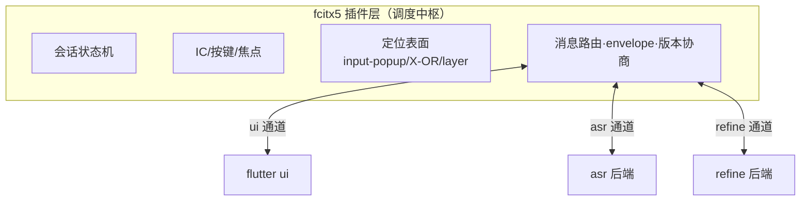
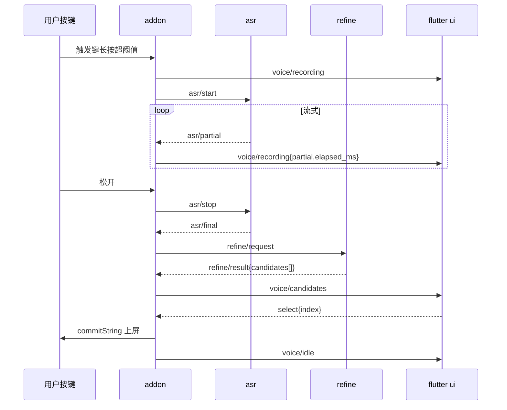

# fcitx5-ai-input 消息流转规范（UI Protocol v1）

状态：Draft（P0，feat/ui-protocol 分支）——本文档是解耦重构的唯一协议真源。
北极星：Flutter UI 成为通用输入法 UI（语音卡+任意引擎候选窗），ASR/refine
为独立后端，addon 层统一调度，三条边同协议。

## 1. 设计原则

1. **星型拓扑**：addon 是唯一编排者（会话状态机、IC/按键/焦点、定位表面、
   消息路由）；flutter ui / asr / refine 三个后端**平级**，互不感知。
2. **同一 envelope**：三条边共用一种消息封套，仅 channel 不同。
3. **传输无关**：同一事件集可跑在
   - 进程内 platform channel（现状：`fcitx5/flutterui` + JSONMethodCodec，
     wire 即 `{method, args}`，channel/dir 由物理方向隐含）
   - stdio / Unix socket（P6：UI 或后端进程外）
   - **文件回放**（`lab/spec/events/*.jsonl`，每行一个完整 envelope）
4. **版本协商**：每通道会话首条 `hello`，双方宣告 `proto` 版本与能力位
   `caps[]`；不识别的 method 必须忽略（向前兼容）。
5. **无回执语义**：事件即状态（voice/panel/asr/refine 全量推送），命令
   （ui→addon）不承诺应答；可靠性由状态机全量重推保证。

## 2. Envelope

```json
{"v":1,"channel":"ui","dir":"out","method":"voice/recording","seq":42,
 "args":{"partial":"你好","elapsed_ms":1200}}
```

| 字段 | 类型 | 说明 |
|---|---|---|
| v | int | 协议版本，当前 1 |
| channel | string | `ui` \| `asr` \| `refine` |
| dir | string | `out`（addon→后端）/ `in`（后端→addon）。进程内传输可省略（方向隐含）；回放文件必须带 |
| method | string | 见各通道事件表；未知 method 忽略 |
| seq | int? | 单调递增，回放/诊断用，接收方不依赖 |
| args | object | 事件参数，schema 见 §6 |

回放文件附加约定：`_delay_ms`（数字）= 分发此事件前等待毫秒；`_comment`
（字符串）行 = 注释，分发器跳过。

## 3. 架构与数据流



语音会话：



## 4. ui 通道

### 4.1 addon → ui（dir=out）

| method | args | 语义（旧字段来源） |
|---|---|---|
| `hello` | `{proto:int, caps:[string]}` | 会话开始；caps：`paging` `vertical` `preedit` `actionable` |
| `theme` | `{font_path?, font_family?, font_size:int, anim:float, scale:float?}` | 合并旧 `state=font` 与每消息携带的 `anim`；`anim`=动画挡位系数（1.0/1.6/3.0） |
| `voice/recording` | `{partial:string, elapsed_ms:int}` | 旧 recording 态 |
| `voice/result` | `{final:string, timeout_ms:int}` | 旧 result 态（LLM Off 档自动上屏倒计时） |
| `voice/candidates` | `{final:string, candidates:[string], hover:int, llm_dummy:bool}` | 旧 candidates 态 |
| `voice/idle` | `{}` | 旧 idle 态（含 Pressing 归并） |
| `panel/update` | `{preedit:[{text,underline}], aux_up, aux_down, candidates:[{label,text,comment?}], cursor:int, layout:"horizontal"\|"vertical", has_prev:bool, has_next:bool, page:int, im_name}` | classicui 等价：映射自 ic->inputPanel()（P4）；preedit 为格式段数组 |
| `panel/hide` | `{}` | 隐藏候选面板 |
| `panel/caret` | `{rect:{x,y,w,h}, space:"window-local"\|"output"}` | layer/X 路径实时重锚数据源（rectWatcher 常驻化，P4） |

### 4.2 ui → addon（dir=in）

| method | args | 语义 |
|---|---|---|
| `ready` | `{}` | UI 引擎就绪（旧同名） |
| `resize` | `{w:int, h:int}` | UI 内在尺寸上报（含阴影余量；旧同名） |
| `select` | `{index:int}` | 选中候选（语音=旧 selectCandidate；panel=CandidateWord::select） |
| `hover` | `{row:int}` | 悬停行变化（旧 hoverChanged） |
| `navigate` | `{delta:int?, page:int?, focus:bool}` | panel 模式键盘/滚轮导航（Pageable/CursorMovable） |
| `panel/action` | `{index:int, action:string}` | ActionableCandidateList |
| `cancel` | `{}` | Esc/取消请求 |

## 5. asr / refine 通道

### asr（addon→engine: out；engine→addon: in）

| method | dir | args | 与现状对应 |
|---|---|---|---|
| `asr/start` | out | `{cfg:{engine,model_dir?,num_threads?,...}, streaming:bool}` | AsrEngine::start |
| `asr/stop` | out | `{}` | stop（正常收尾出 final） |
| `asr/cancel` | out | `{}` | cancel（丢弃） |
| `asr/partial` | in | `{text:string}` | Callbacks.onPartial（全量式） |
| `asr/final` | in | `{text:string}` | Callbacks.onFinish |
| `asr/cancelled` | in | `{}` | cancel 确认（无输出） |

### refine（addon→refine: out；refine→addon: in）

| method | dir | args | 与现状对应 |
|---|---|---|---|
| `refine/request` | out | `{raw:string, context?:string, mode:"polish"\|"candidates"}` | onAsrFinish 后触发 |
| `refine/result` | in | `{candidates:[string], engine_tag:string}` | 现 Dummy 档 `candidates_={polish(final), final}`；engine_tag 如 `dummy`/`openai` |

## 6. JSON Schema

`lab/spec/schema/envelope.schema.json` 校验 envelope 结构；
`events.schema.json` 校验各 channel/method 的 args。回放脚本必须过 schema
（proto-test 容器的断言之一）。

## 7. 旧 → 新映射表（适配器依据，P2）

| 旧（JSONMethodCodec update/命令） | 新 |
|---|---|
| `update{state:recording, partial, elapsed_ms, anim}` | `theme{anim}`（变化时）+ `voice/recording` |
| `update{state:result, final, timeout_ms, anim}` | `voice/result` |
| `update{state:candidates, final, candidates, hover, llmDummy, anim}` | `voice/candidates` |
| `update{state:idle, anim}` | `voice/idle` |
| `update{state:font, path, family, size, anim}` | `theme{font_path,font_family,font_size,anim}` |
| `ready` / `resize{w,h}` | 同名不变 |
| `selectCandidate{index}` | `select{index}` |
| `hoverChanged{row}` | `hover{row}` |
| （无对应） | `hello` `panel/*` `navigate` `panel/action` `cancel` |

适配规则：addon 内发射器统一产 v1 envelope，经**兼容适配器**转旧 wire 给
现有 Dart（过渡期），Dart 侧切换后适配器删除。

## 8. 回放脚本

`lab/spec/events/*.jsonl`：每行一个 envelope 或控制行（`_delay_ms`/
`_comment`）。ui 侧分发器只消费 `channel=="ui" && dir=="out"`；proto-test
对全通道做 schema 校验与往返对拍。首批脚本：

- `voice-full.jsonl` 语音全状态（recording 流式→candidates→select→idle）
- `voice-result-auto.jsonl` Result 态自动上屏倒计时路径
- `pinyin-flow.jsonl` panel/update 逐键流+翻页+选择
- `panel-vertical.jsonl` 竖排布局
- `theme-change.jsonl` 字体/动画挡位热改
- `asr-refine-flow.jsonl` 三通道完整会话（hub 视角回放）

## 9. 演进

- P2：addon 三边发射器接 v1；P3 模块拆分（core/hub/edges/surfaces/embedder）
- P4：panel/* 落地（classicui 等价）；P6：stdio/socket 传输
- 破坏性变更：升 `v`，hello 协商失败则降级忽略
